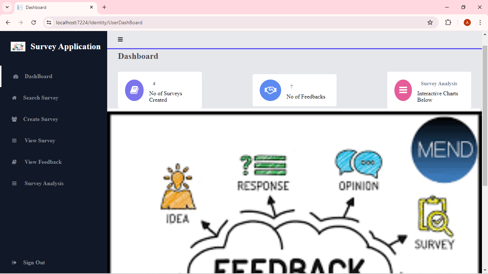

# Salah Survey and feedback Application

## Description

This Survey and Feedback Application, built using ASP.NET MVC, is a robust and user-friendly platform designed to streamline the process of creating, sharing, and analyzing surveys. This application provides a comprehensive suite of tools for users to gather valuable feedback efficiently and effectively.
## Language, Framework and library  
<ul>
   <li>C#</li>
  <li>HTML5</li>
  <li>JavaScript</li>
  <li>CSS</li>
  <li>Entity FRamework</li>
  <li>Asp .Net Core MVC</li>
  <li>Bootstrap</li>
  <li>Identity Framework</li>
  <li>MySql Server</li>
  <li>Microsoft.Tools</li>
</ul>

### screenshot showing the homepage form when creating question

### screenshot showing the survey Analysis after response have been given to a survey
.png "creating  questions in a survey Application")
### screenshot showing the survey form when creating question
.png "creating  questions in a survey Application")
### screenshot showing search when looking for an already created survey
.png "creating  questions in a survey Application")
### screenshot showing survey response
.png "creating  questions in a survey Application")
### screenshot showing survey link to share to give response to survey
.png "creating  questions in a survey Application")

<ul>
  
</ul>

